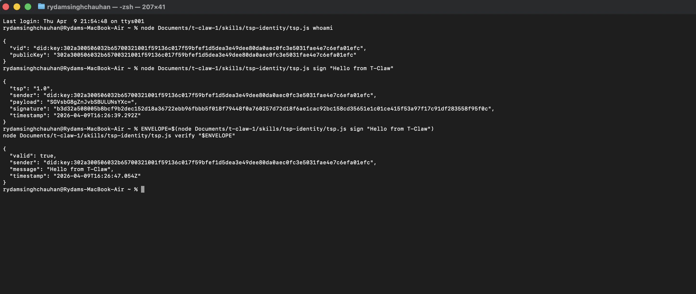

# T-Claw

T-Claw adds TSP (Trust Spanning Protocol) identity to [OpenClaw](https://github.com/openclaw), an open source AI agent framework. It is a reference implementation of the TEA (TSP-Enabled AI Agent) protocol.

---

## Demo



The demo shows all three operations running end-to-end: generating a VID, signing a message, and verifying the signature returns `valid: true`.

---

## The problem

AI agents have no cryptographic identity by default. When an agent sends a message, there is no way to prove it actually came from that agent and wasn't spoofed or tampered with in transit.

TSP fixes this. Each agent gets a VID (Verified Identity) backed by an Ed25519 keypair. Outgoing messages are signed with the private key. Anyone receiving the message can verify the signature using the public key embedded in the VID — no central authority needed.

---

## How it works

T-Claw wires TSP into OpenClaw's skill system. Install the skill, and your agent can:

- prove its identity with a `did:key` VID
- sign any outgoing message into a TSP envelope
- verify any incoming TSP envelope

---

## Project structure

```
t-claw/
├── skills/
│   └── tsp-identity/
│       ├── SKILL.md      ← OpenClaw skill definition and instructions
│       └── tsp.js        ← TSP sign/verify/whoami logic (no dependencies)
├── docs/
│   └── architecture.md
├── examples/
│   ├── demo.md
│   └── demo.png          ← end-to-end terminal demo
└── README.md
```

---

## Install

```bash
git clone https://github.com/rid325/t-claw
cp -r t-claw/skills/tsp-identity ~/.openclaw/workspace/skills/
```

No npm install needed — `tsp.js` uses only Node.js built-in modules. Restart OpenClaw and the skill is live.

---

## Usage

Run directly from the terminal:

```bash
# Show your agent's VID and public key
node skills/tsp-identity/tsp.js whoami

# Sign a message
node skills/tsp-identity/tsp.js sign "Hello from T-Claw"

# Verify a signed envelope
ENVELOPE=$(node skills/tsp-identity/tsp.js sign "Hello from T-Claw")
node skills/tsp-identity/tsp.js verify "$ENVELOPE"
```

Or via OpenClaw chat once the skill is loaded:

- `show my TSP identity`
- `sign this message: hello world`
- `verify this message: <paste envelope JSON>`

---

## Implementation note

`tsp.js` uses Node.js built-in `crypto` (Ed25519) to implement TSP concepts. The official `@trustoverip/tsp-sdk` from the [Trust over IP Foundation](https://trustoverip.org) is in active development. When it ships, `tsp.js` can swap it in as a drop-in — the interface stays the same.

---

## License

Apache 2.0
